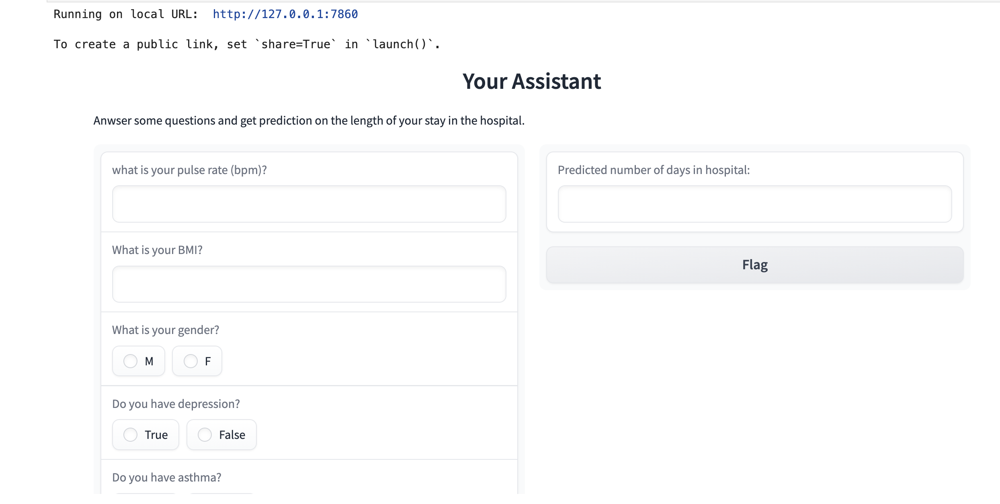

# ML Model

## Problem Description

This ML model predicts how long a patient will stay in a hospital on various features from the patient's medical history, such as age, gender, diagnosis, and so on.

## Data

The dataset has details such as age, gender, and various diagnoses. There are 100,000 records, each with 25 different features, of which 70,000 are used for training and 30,000 for testing.

## Gradio App

